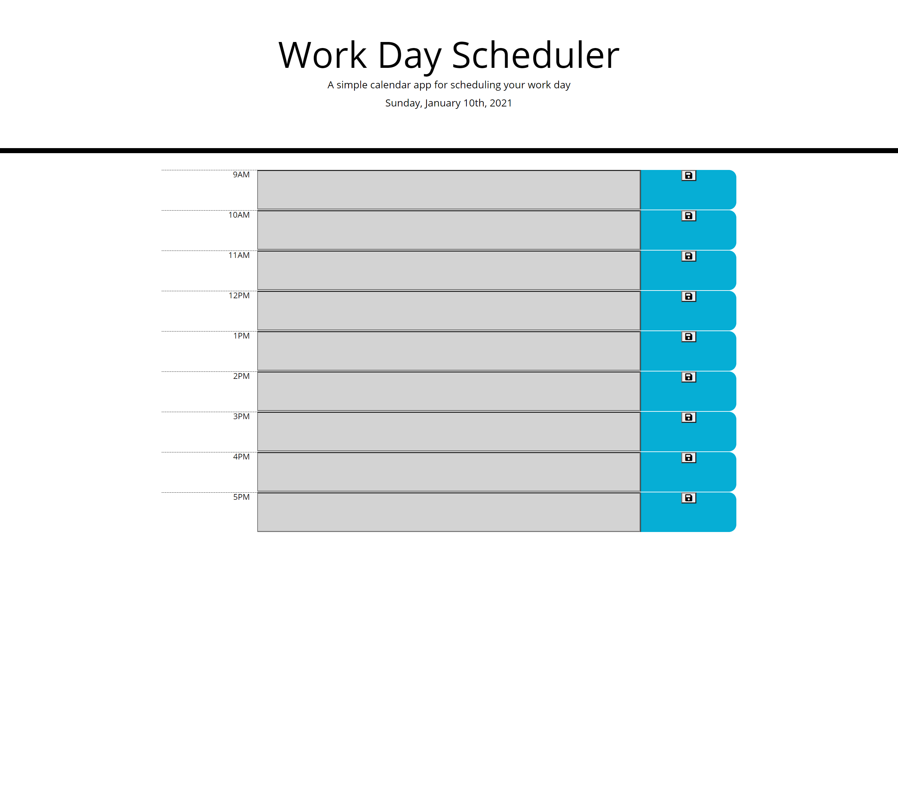

# Work Day Scheduler 

Work Day Scheduler is a daily planner application that allows a user to input tasks into time blocks for standard business hours. Each time-block is color-coded to indicate if it is in the past, present, or future.

 
## Files and Directories
There is a gitignore file. The js, css, and images folders live in the assets directory.

## Publishing
The website is published using github pages.

## Link to application
[Click here to visit the Work Day Scheduler!](https://mymy-4242.github.io/scheduler-challenge5/)
